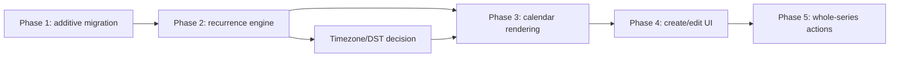

# v0.1.6 Recurring Events Implementation Plan

## Purpose

This plan turns the approved v0.1.6 recurring-events investigation and
specification into five ordered, verifiable implementation phases. It is a plan
only: no code, SQL, migration, RLS change, or deployment is performed by this
document.

References:

- [Architecture investigation](./v0.1.6_RECURRING_EVENTS_INVESTIGATION.md)
- [Recurring events specification](./v0.1.6_RECURRING_EVENTS_SPEC.md)

## Non-negotiable implementation boundary

Every phase must preserve these constraints:

- Do not implement RFC 5545 RRULE parsing, import, export, or arbitrary rule
  fields.
- Support only the v1 daily, weekly, monthly, and yearly rule shapes defined in
  the specification.
- Do not add exceptions, skipped dates, detached occurrences, split series, or
  any single-occurrence mutation.
- Do not materialize occurrences in the database.
- Do not add an `event_recurrences` or occurrence table.
- Do not change the existing `scope + owner_user_id` ownership model.
- Do not modify existing event RLS semantics: space members read events,
  members manage shared events, and only the personal owner manages personal
  events.
- Treat a generated occurrence as frontend display data; all writes use its
  source `events.id`.
- Do not add a production dependency without explicit user approval.

## Dependency order

The phases are sequential. Phase 2 can begin its non-timezone types and test
scaffolding in parallel with Phase 1 review, but it must not be merged or wired
into views before the data contract and timezone implementation approach are
approved.

## Phase 1 — Database migration

### Goal

Add a backward-compatible nullable recurrence rule to the existing source
event row. No occurrence is persisted and no authorization model is changed.

### Files in scope

- New versioned `supabase/patches/<date>-v0.1.6-recurring-events.sql`.
- `supabase/schema.sql` to keep fresh installs consistent with the approved
  patch.
- `docs/TESTING.md` for preflight and database/RLS verification evidence.
- `docs/DEVLOG.md` and `docs/PROJECT_STATE.md` after successful implementation
  and verification, if their status headings change.

### Explicitly not modified

- `src/**`.
- Existing patch files.
- Existing `events` identity fields: `id`, `space_id`, `created_by`, `scope`,
  and `owner_user_id`.
- Existing `events` RLS policies, event-owner trigger behavior, Realtime
  publication, and `REPLICA IDENTITY FULL`.
- Existing event rows; no backfill is needed because `NULL` means one-off.

### Work items

1. Write a read-only preflight query that confirms the target column is absent
   or that existing values are null/valid before applying an additive patch.
2. Add nullable `recurrence_rule jsonb` with no non-null default.
3. Add narrow structural validation equivalent to the v1 specification:
   supported frequency, interval range, weekly `days_of_week`, monthly
   `day_of_month`, yearly `month` + `day`, and valid IANA timezone. Use a check
   constraint and/or a focused trigger; do not alter the ownership trigger's
   protection of stable identity fields.
4. Update the fresh-install schema only after the patch is reviewed.
5. Verify the existing policies/functions/Realtime configuration retain their
   behavior.

### Tests and verification

- Run the documented preflight against the intended Supabase environment before
  execution.
- Verify an existing one-off row reads as `recurrence_rule = null` and can still
  be selected, updated, and deleted according to current permissions.
- Verify valid daily, weekly, monthly, and yearly JSON values are accepted;
  malformed values and invalid selector combinations are rejected.
- Run current two-account direct API checks for shared and personal events,
  including immutable identity fields and owner-only personal management.
- Verify an `events` recurrence-rule update reaches the existing Realtime
  channel.

### Acceptance criteria

- [ ] Existing event data requires no backfill and remains one-off.
- [ ] One source row stores one valid v1 recurrence rule.
- [ ] The existing RLS/owner-trigger authorization results are unchanged.
- [ ] No recurrence or occurrence table exists, and no occurrence row is
  inserted.

### Checkpoint

Pause for review of the production patch result, preflight output, RLS
regression, and documented verification before starting frontend integration.

## Phase 2 — Recurrence engine

### Goal

Create a pure, deterministic frontend projection engine that converts source
events into finite display occurrences for a supplied range.

### Files in scope

- `src/types.ts` for persisted recurrence-rule and non-persisted occurrence
  types.
- `src/lib/date.ts` or a new focused `src/lib/recurrence.ts` for validation,
  range calculation, and expansion helpers.
- New unit-test files under the test location selected for the project.
- `package.json` / lockfile **only if** the user explicitly approves a required
  test or timezone dependency.

### Explicitly not modified

- `src/App.tsx` and components; this phase does not change visible UI.
- `supabase/**`, RLS, migrations, RPCs, and Realtime configuration.
- Event writes; the engine must be read-only and must not call Supabase.

### Work items

1. Model `RecurrenceRuleV1` and `CalendarOccurrence` separately from the
  mutable `CalendarEvent` source type.
2. Validate/canonicalize client rule input: strict frequency fields, sorted
  weekly days, monthly number or `last_day`, interval, and IANA timezone.
3. Implement range-bounded daily, weekly, monthly, and yearly candidate
   generation.
4. Apply the specified month-end behavior: invalid numeric dates skip; only
   `last_day` tracks the final date of a month.
5. Apply yearly `month` + `day` behavior, including a February 29 candidate
   only in eligible leap years.
6. Preserve duration, deduplicate the source occurrence, intersect with the
  display range, sort deterministically, and stop at the 500-candidate cap.
7. Define the safe error result for an invalid rule, unsupported timezone, or
  cap reached; callers must never display a silent partial occurrence list.

### Tests and verification

- Add deterministic tests before connecting the engine to calendar views.
- Cover daily/weekly/monthly/yearly frequencies, intervals, weekly anchor
  weeks, source-start inclusion, range intersection, duration preservation,
  stable occurrence IDs, ordering, and no duplicate source occurrence.
- Cover February in leap/non-leap years, numeric 29/30/31, `last_day`, and
  interval month arithmetic after skipped months; cover yearly February 29 and
  yearly interval arithmetic after skipped non-leap years.
- Cover timezone conversion and the specified DST gap/overlap policy once a
  timezone-capable utility has been selected.
- Cover the 500-candidate cap as an explicit failure rather than partial data.

### Acceptance criteria

- [ ] Given the same source rows, range, and timezone data, expansion returns
  the same ordered occurrence projections.
- [ ] No occurrence is written to Supabase and generated IDs cannot be used as
  an event mutation ID.
- [ ] Month-end and DST behaviors match the specification's test cases.
- [ ] Invalid/over-limit input produces a safe explicit result.

### Checkpoint

Review the pure engine and its date tests before it affects rendering. Run the
project's approved test command and `npm run build` after introducing types or
new test tooling.

## Phase 3 — Calendar rendering integration

### Goal

Replace raw-event display filtering with bounded occurrence projection while
keeping the existing source-event load, RLS, and Realtime behavior intact.

### Files in scope

- `src/App.tsx` for selected-view range calculation and prop flow.
- `src/lib/date.ts` and/or `src/lib/recurrence.ts` for range helpers used by the
  three calendar views.
- `src/types.ts` only if the Phase 2 display contract needs a minimal adjustment.
- Component files only if the current in-file `CalendarViews`, `MonthView`,
  `DaySection`, or `EventCard` extraction is deliberately approved.

### Explicitly not modified

- `supabase/**`, RLS policies, database schema, and Realtime publication.
- The `loadEvents(spaceId)` source query shape, except for type-safe handling
  of the additive recurrence field.
- Event create/update/delete payload semantics; they remain source-row actions
  until later phases.
- Authentication, space membership, invite, reminder, and unrelated UI work.

### Work items

1. Keep `events: CalendarEvent[]` as source state and calculate a display range
   for Today, Week, and the full 42-cell Month grid.
2. Project source rows into `CalendarOccurrence[]` only for that range.
3. Pass occurrences to all views; use occurrence IDs for list keys and source
   event data for labels and permissions.
4. Preserve current day-intersection semantics for duration-spanning events and
   ensure month marker counts include recurring occurrences in adjacent visible
   grid cells.
5. On source-event Realtime changes, retain the existing reload then
   re-projection behavior.
6. Show a safe visible error if expansion fails; do not silently omit a series.

### Tests and verification

- Unit-test range construction for Today, Week, and Month's 42 visible cells.
- Verify one-off events render exactly as before in all views.
- Manually verify one daily, weekly, monthly, and yearly source event in Today,
  Week, and Month, including changing the selected date/view.
- Run two authenticated clients: create/update/delete a source series in one
  client and confirm the other reprojects after existing Realtime reload.
- Measure/inspect normal-space rendering with several long-running daily and
  weekly rules; verify expansion remains range-bounded and responsive.

### Acceptance criteria

- [ ] Every visible recurrence occurrence appears in the correct calendar
  range, and no out-of-range occurrence is rendered.
- [ ] Existing one-off cards, multi-day intersection, and month markers retain
  their current behavior.
- [ ] The UI has no path that treats a generated occurrence as a persisted row.
- [ ] A Realtime source update refreshes all relevant generated occurrences.

### Checkpoint

Run `npm run build`, the recurrence unit tests, and a desktop two-account
Realtime smoke test before adding new form controls.

## Phase 4 — Create and edit UI

### Goal

Allow users to create and edit a source event's v1 recurrence rule without
expanding the product into an RFC rule editor or an occurrence editor.

### Files in scope

- `src/App.tsx` for the current `EventDraft`, `EventSheet`, payload validation,
  and read-only details.
- `src/types.ts` if a form draft type needs a minimal recurrence representation.
- `src/styles.css` only for styles necessary for the added controls and existing
  mobile layout.
- `src/lib/recurrence.ts` or `src/lib/date.ts` for reusable rule summary and
  draft conversion helpers.

### Explicitly not modified

- `supabase/**`, migration definitions, RLS, auth, membership, invites, and
  Realtime configuration.
- Event identity/ownership selection behavior after creation; `scope` and
  `owner_user_id` remain immutable on edit.
- Any reminder, notification, external-calendar, or unrelated visual redesign.

### Work items

1. Add an explicit non-recurring / daily / weekly / monthly / yearly choice to
   the event form.
2. Show only the selectors permitted by the chosen frequency: interval for all,
   weekday set for weekly, numeric day or `last_day` for monthly, and month plus
   numeric day for yearly.
3. Default rule values from the event's start time and selected recurrence
   timezone; validate before the Supabase source-row write.
4. Serialize `null` for non-recurring events and a canonical v1 JSON value for
   recurring events.
5. On editing, load and display the existing rule; show a readable recurrence
   summary in editable and read-only event details.
6. Clearly state that saving modifies the whole repeated series.

### Tests and verification

- Verify form validation cannot submit wrong frequency/selector combinations,
  unsorted/duplicate weekdays, invalid monthly/yearly date selectors, invalid
  interval, or invalid timezone.
- Verify a new shared series and both possible personal-owner series create
  with the correct existing ownership permissions.
- Verify edit keeps the source event's stable identity fields unchanged and
  changing a recurrence rule updates the entire rendered series.
- Verify a non-owner viewing a personal recurring event sees details but no
  editing controls.
- Run `npm run build` and mobile-layout smoke checks on the supported narrow
  iPhone Safari and Android Chrome/PWA form flows.

### Acceptance criteria

- [ ] Users can create valid daily, weekly, monthly, and yearly source series,
  or a legacy-compatible non-recurring event.
- [ ] Form controls cannot express exceptions, an end count/date, or a
  one-occurrence operation.
- [ ] The saved rule conforms to v1 and renders consistently after refresh.
- [ ] Existing shared/personal create and edit permission behavior is unchanged.

### Checkpoint

Review the mobile form wording and whole-series disclosure with a human before
enabling destructive series actions.

## Phase 5 — Delete and whole-series behavior

### Goal

Make interactions from a projected occurrence unambiguously target the source
series, including deletion and edit entry points, without implementing
exceptions.

### Files in scope

- `src/App.tsx` for occurrence-to-source selection, edit/delete copy, and
  confirmation behavior.
- `src/types.ts` only if selection state needs a source/occurrence reference.
- `src/styles.css` only if required for an existing-pattern confirmation or
  warning presentation.
- `docs/TESTING.md`, `docs/DEVLOG.md`, and `docs/PROJECT_STATE.md` after
  completed verification, where status changes warrant updates.

### Explicitly not modified

- `supabase/**`, recurrence storage shape, RLS, owner-trigger authorization,
  event Realtime subscription, and source-event CRUD endpoints.
- Any schema for exceptions, detached occurrence records, audit history, or
  recurrence materialization.
- One-off event deletion behavior beyond any minimal shared confirmation copy.

### Work items

1. Ensure selecting any occurrence resolves to its source event before opening
   details or the edit form.
2. Label recurring mutations as “编辑整个重复日程” and “删除整个重复日程”.
3. Require an explicit destructive confirmation for deleting a repeated series,
   using source-event deletion only after confirmation.
4. Keep existing permission checks in the UI for personal non-owners while
   relying on unchanged Supabase RLS as the final enforcement boundary.
5. Ensure the local mutation/reload and Realtime update remove or refresh every
   projected occurrence of the changed source row.

### Tests and verification

- Verify selecting a later occurrence opens its source series rather than a
  synthetic occurrence record.
- Verify deleting any occurrence deletes the one source row and all its visible
  projected occurrences, locally and in a second authenticated client.
- Verify editing from a later occurrence changes all relevant occurrences after
  reload/Realtime propagation.
- Verify a non-owner cannot access edit/delete controls for a personal series,
  and direct Supabase API attempts remain rejected by existing RLS.
- Run `npm run build`, full recurrence tests, two-account shared/personal
  Realtime smoke, and supported iPhone/Android mobile acceptance checks.

### Acceptance criteria

- [ ] No UI text or behavior suggests a single occurrence can be changed.
- [ ] Delete and edit from any occurrence target only `source_event_id`.
- [ ] Shared and personal series retain the existing authorization outcome.
- [ ] No recurrence source, projected occurrence, or Realtime regression
  remains in the final two-account smoke test.

## Final release checkpoint

Before declaring v0.1.6 complete:

- [ ] All five phase acceptance criteria are met in dependency order.
- [ ] The approved migration was applied once per intended environment and
  documented with preflight/rollback information.
- [ ] `npm run build` passes.
- [ ] Recurrence engine tests pass using the approved test setup.
- [ ] Desktop two-account, iPhone Safari, and Android Chrome/PWA checks cover
  shared/personal ownership, Realtime, all views, and whole-series behavior.
- [ ] `docs/TESTING.md`, `docs/DEVLOG.md`, and `docs/PROJECT_STATE.md` reflect
  the verified implementation state without duplicating the full plan.
- [ ] Code review checks recurrence scope, RLS preservation, timezone behavior,
  and generated-occurrence safety before merge.

## Risks and mitigations

| Risk | Impact | Mitigation and decision gate |
| --- | --- | --- |
| Timezone handling | High | Store required IANA timezone in every rule; calculate wall-clock recurrence in that timezone and render the resulting instant in the viewer's local timezone. Choose and test a timezone-capable utility before Phase 2. |
| DST gaps/overlaps | High outside `Asia/Shanghai` | Implement the specified “first valid time after gap / earlier offset on overlap” behavior and add tests. Do not claim DST-zone support until this passes. |
| Occurrence limit | Medium | Range-bound expansion plus a 500-candidate per-source cap. Treat cap reached as an explicit UI error, never a partial list. Confirm the UX copy before Phase 3. |
| Frontend performance | Medium | Keep raw source rows in state; derive only current-view occurrences, memoize only after measurement, and test a normal space with several dense long-running series. Do not pre-expand all future dates. |
| Rule validation drift | Medium | Use one v1 contract shared conceptually by database validation, frontend validation, and engine tests; reject unsupported fields rather than ignoring them. |
| Permission regression | High | Do not add recurrence-specific RLS. Re-run direct API and two-account shared/personal tests after Phase 1 and Phase 5. |

## Blocking status

There is **no blocker to approve this plan**. Before Phase 2 implementation,
the team must decide whether existing browser/runtime capabilities can meet the
IANA/DST policy or whether a timezone/test dependency is needed. The latter
requires explicit user approval before installation. This is an implementation
gate, not a reason to broaden v0.1.6 scope.
