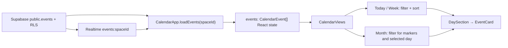

# v0.1.6 Recurring Events Architecture Investigation

## Scope and conclusion

This document records an architecture investigation for v0.1.6 recurring
events only. It does not change application code, the database, migrations, or
RLS policies.

**Recommendation:** for the v0.1.6 MVP, add nullable recurrence metadata to
`public.events` (Option A), expand occurrences in the frontend only for the
currently visible calendar range, and treat each generated occurrence as a
display projection of its source event. Keep exceptions, per-occurrence edits,
and materialized database occurrences explicitly out of v0.1.6.

This is the smallest change that preserves the current single-event CRUD,
Realtime, and RLS model. It also leaves a clean migration path to a dedicated
recurrence table if exception handling becomes a product requirement.

## Investigation sources

- `supabase/schema.sql`
- `supabase/patches/2026-06-20-v0.1.1-personal-permissions.sql`
- `supabase/patches/2026-07-11-v0.1.4-member-display-name.sql`
- `src/types.ts`
- `src/lib/date.ts`
- `src/App.tsx`

No external sources, production data, environment variables, SQL execution, or
Supabase Dashboard access was used.

## 1. Current events schema

### `public.events` fields

| Field | Type / default | Current purpose |
| --- | --- | --- |
| `id` | `uuid`, generated | Stable event identity. |
| `space_id` | `uuid`, required | Parent shared space; references `spaces(id)` with cascade delete. |
| `created_by` | `uuid`, required, `auth.uid()` | Creator identity; references `auth.users`. |
| `scope` | `text`, required | `shared` or `personal`. |
| `owner_user_id` | nullable `uuid` | Personal-event owner; references `auth.users`. |
| `title` | `text`, required | Event title. |
| `description` | nullable `text` | Optional description. |
| `starts_at` | `timestamptz`, required | Start instant. |
| `ends_at` | nullable `timestamptz` | Optional end instant. |
| `all_day` | `boolean`, default `false` | All-day presentation flag. |
| `created_at` | `timestamptz`, default `now()` | Creation audit timestamp. |
| `updated_at` | `timestamptz`, default `now()` | Mutation audit timestamp, maintained by trigger. |

Constraints require `scope` to be `personal` or `shared`, keep `ends_at >=
starts_at` when an end is supplied, and enforce the valid scope/owner shape:

- Shared: `scope = 'shared'` and `owner_user_id is null`.
- Personal: `scope = 'personal'` and `owner_user_id is not null`.

Indexes are `(space_id, starts_at)` and `(owner_user_id)`. `events` has
`REPLICA IDENTITY FULL` and is included in the `supabase_realtime`
publication.

### Shared and personal structure

`scope + owner_user_id` is the durable ownership model; UI-relative values such
as “mine” and “partner” are derived client-side. The event-owner trigger also:

- prevents changing `space_id`, `created_by`, `scope`, or `owner_user_id` on
  update;
- validates that a personal owner is a member of the event's space;
- rejects invalid shared/personal owner shapes.

RLS separates visibility from management:

| Operation | Permission |
| --- | --- |
| Select | Any member of `space_id`. |
| Insert | Space member, with `created_by = auth.uid()`. |
| Update/delete shared event | Any member of its space. |
| Update/delete personal event | Only `owner_user_id`. |

Therefore both members can read a personal event, including its recurrence
metadata in a future schema, while only its owner can alter the series. Shared
series remain jointly manageable. This behavior is already implemented by
`can_manage_event(space_id, scope, owner_user_id)` and should not be replaced
with recurrence-specific permissions.

## 2. Current event read and display flow

### Read and update path

1. `CalendarApp.loadSpace()` reads one RLS-visible `spaces` row.
2. After a space is available, `loadEvents(space.id)` performs
   `from('events').select('*').eq('space_id', spaceId).order('starts_at')`.
   There is no date-range query, RPC, view, or server-side event projection.
3. The returned database rows are cast directly to `CalendarEvent[]` and set
   into `events` state.
4. The `events:${space.id}` Realtime channel subscribes to all changes to the
   same `space_id`. Every insert/update/delete reloads the complete event list.
5. `EventSheet` creates, updates, and deletes directly against `events`; a
   successful mutation reloads the list, while Realtime covers other clients.

### Calendar display transformation

There is no distinct display-data type today. `CalendarEvent` flows directly
to views. `src/lib/date.ts` supplies the only transformation logic:

- `eventFallsOnDay` intersects one event's start/end with a local calendar day.
- `sortEvents` orders by `starts_at`.
- Today and week filter the full `events` array once per displayed day, then
  sort.
- Month uses the same filter for each of its 42 cells to decide the dot marker,
  and again for the selected day's event cards.
- `EventCard` formats time and derives the audience label from `scope`,
  `owner_user_id`, and the loaded members.

The current approach is simple and acceptable for a small one-off event list,
but recurrence must not be expanded into an unbounded array in state.

### Components and types that would change in implementation

| Location | Recurrence responsibility |
| --- | --- |
| `src/types.ts` | Add persisted recurrence fields and a separate occurrence display type. Do not overload a generated occurrence as a mutable database event. |
| `src/lib/date.ts` | Add pure range calculation and expansion helpers; retain `eventFallsOnDay` for the projected occurrence shape. |
| `CalendarApp` in `src/App.tsx` | Keep loading source events and Realtime subscription; compute a bounded visible range from the selected date/view. |
| `CalendarViews` / `MonthView` | Receive projected occurrences instead of raw source events, so markers and cards show every in-range occurrence. |
| `DaySection` / `EventCard` | Use occurrence identity for React keys; optionally label a recurring series. |
| `EventSheet` | Add a v0.1.6 recurrence selector and serialize it into the source event. Editing/deleting a series must be described as applying to the whole series. |
| Read-only event detail | Display recurrence summary and retain personal owner-only management behavior. |

## 3. Recurrence data-model options

### Option A: recurrence fields on `events`

Add nullable, event-level recurrence metadata, for example a canonical
`recurrence_rule text` containing an RFC 5545-inspired RRULE subset. A null
value means the existing one-off event. The source event remains the first
occurrence and remains the only mutable row for the series in v0.1.6.

For MVP, restrict accepted semantics rather than accepting arbitrary RRULE:

- frequency: `DAILY`, `WEEKLY`, or `MONTHLY`;
- positive interval, default `1`;
- optional inclusive-until instant or maximum count, but not both if the UI
  should stay simple;
- no `BYSETPOS`, `WKST`, multiple weekly days, `EXDATE`, `RDATE`, or
  exceptions in v0.1.6.

An alternative is structured nullable columns such as `recurrence_frequency`,
`recurrence_interval`, and `recurrence_until`. They are easier to constrain and
query, but create more schema surface. For the small fixed MVP subset, either
is viable; a single validated `recurrence_rule` keeps the initial migration
smaller and provides a familiar future interchange format.

### Option B: `event_recurrences` table

Create one recurrence-definition row per event, typically with `event_id` as a
unique foreign key plus rule, boundary, timestamps, and possibly future
exception relations. The base event remains content/ownership/time seed, while
the child row describes its series.

This becomes attractive when product scope needs exception dates, an edited
single occurrence, detached occurrence records, multiple rules per event, or
server-side querying/reporting of recurrence definitions. It introduces a
second protected resource and a join/loading/subscription problem immediately.

### Comparison

| Criterion | Option A: field on `events` | Option B: `event_recurrences` table |
| --- | --- | --- |
| MVP development cost | Lowest: one additive column, one payload, one source-row lifecycle. | Higher: table, foreign key/indexes, RLS policies, join/query shape, Realtime strategy, and transactional writes. |
| RLS impact | No new policy needed if metadata is part of the same row; existing event policies continue to govern it. | New select/insert/update/delete policies must prove access through the parent event. Policy drift is a real risk. |
| Data consistency | Strong for MVP: source content and rule update atomically in one row. | More relationships to keep consistent; deleting events cascades safely only if designed, but update/create flows need coordinated operations. |
| Future extensibility | Adequate for one rule and whole-series edits. Later exceptions may require a child table or additional fields. | Best foundation for rich recurrence and exceptions, but premature for a no-exception MVP. |
| Existing code fit | Directly matches `select('*')`, direct insert/update, events-only Realtime, and current types. | Requires changing every event retrieval/mutation assumption and probably subscribing to two tables. |

**Decision for v0.1.6:** Option A. The product's current architecture has one
authoritative event row and direct CRUD. A recurrence rule is event content,
not a new permission-bearing entity for the stated MVP.

## 4. Where to expand occurrences

### Frontend expansion

The client reads source events, expands recurring source events only inside the
visible range, and passes generated display occurrences to the calendar views.

Benefits:

- matches the current direct Supabase read and one-table Realtime channel;
- does not add RPCs, database functions, new policies, or materialized data;
- lets range bounds match today/week/month exactly;
- keeps source event RLS as the only authorization boundary.

Constraints:

- expansion must be pure, deterministic, timezone-aware, and bounded;
- the generated object needs `source_event_id` and an occurrence start key so
  React keys and UI actions are stable;
- actions in v0.1.6 must target the source event and explicitly mean
  “edit/delete the series,” never a synthetic occurrence ID;
- do not use client-local `Date#setMonth` without tests for month-end behavior
  (for example, a 31st monthly series) or DST boundaries.

### Backend/API expansion

An RPC or API could accept a space and time range and return expanded rows.
This centralizes date math and eventually supports multiple clients, but it
adds a new security surface and query contract. The project currently has no
custom event API; the browser accesses Supabase directly. An RPC would also
need deliberate RLS-equivalent membership checks and a Realtime invalidation
strategy.

This is not justified for v0.1.6, but is a sensible next step if a native app,
external API, or a large event volume needs a shared expansion implementation.

### Database expansion / materialized occurrences

Database-generated occurrence rows or a materialized occurrence table make
range queries and indexing efficient, but introduce the greatest operational
cost: generation jobs/triggers, cleanup, exception semantics, write ordering,
additional RLS, Realtime publication, and backfill behavior. Storing every
future occurrence is especially hazardous for never-ending rules.

Do not choose this for v0.1.6.

### Recommended placement

Use **frontend range-bounded expansion**. The source `events` rows remain the
only persisted and authorized objects. For each view, calculate a small query
projection range:

- Today: selected local day.
- Week: Monday 00:00 through Sunday 23:59:59.999 local time.
- Month: the displayed 42-cell grid range, not merely the calendar month,
  because adjacent-month cells currently have markers.

To preserve cross-device behavior, v0.1.6 should establish an explicit
timezone policy before implementation. With existing `timestamptz` data and
local rendering, the minimal policy is “repeat in the local civil timezone
used to create/edit the series”; storing that IANA timezone alongside the rule
would be more correct, but adds another field and product decision. Do not
silently claim that UTC stepping preserves local wall-clock time across DST.
Given the app's current target and scope, document the v0.1.6 timezone rule
and test it on the supported devices before release.

## 5. Safe migration design

The future migration must be additive, idempotent where practical, and placed
in `supabase/patches/`; it must not rerun `supabase/schema.sql` in an existing
Supabase environment.

### Compatibility requirements

1. Add a nullable recurrence field with no default. Existing rows remain
   one-off events because `NULL` means no recurrence.
2. Do not change `id`, `space_id`, `created_by`, `scope`, or `owner_user_id`.
   The existing trigger must continue protecting those fields.
3. Do not alter the valid shared/personal owner shape or the existing event
   policies. The recurrence field is protected by the same row-level update
   authorization as title and times.
4. If validating a textual rule in SQL, use a deliberately narrow check
   constraint that allows `NULL`. Perform a preflight query first to prove all
   existing rows are null/valid before adding `NOT VALID`/validation only if
   required by the rollout plan.
5. Preserve the current `events` Realtime publication and replica identity.
   A source-row rule change emits the existing `events` update event and causes
   current clients to reload.
6. Update TypeScript only in the implementation task after the database patch
   is applied; a staged deployment must tolerate absent/null recurrence data.

### Proposed rollout order

1. Write a versioned patch containing `alter table ... add column if not
   exists recurrence_rule text null` and the narrow validation approach chosen
   for the MVP grammar. Do not add a non-null default.
2. Extend the canonical `supabase/schema.sql` to reflect the final fresh-install
   schema, after the patch is reviewed. This is a schema source update, not an
   instruction to execute it in production.
3. Confirm the existing `events_select_member`, `events_insert_member`,
   `events_update_member`, and `events_delete_member` policy definitions are
   unchanged; no recurrence-specific RLS policy is necessary for Option A.
4. Deploy frontend support that reads null as one-off and writes a rule only
   when the user selects recurrence.
5. Verify two-member shared and personal series, including source-row update
   and delete propagation through existing Realtime.

No historical data backfill is needed. Existing events must continue to render
and mutate exactly as they do today.

## v0.1.6 implementation boundary

Recommended in scope:

- simple daily, weekly, and monthly series;
- whole-series create, display, edit, and delete;
- bounded frontend projection for today/week/month;
- preserved shared/personal ownership and Realtime semantics;
- test coverage for range bounds, all-day events, end boundary, month-end, and
  owner/read-only behavior.

Explicitly defer:

- editing or deleting one occurrence;
- skipped dates, exception dates, detached occurrences, or split series;
- multiple recurrence rules per event;
- database materialization, occurrence table, RPC/API expansion, and external
  calendar sync.

## Follow-up implementation guidance

Before coding, create a v0.1.6 specification that fixes the rule grammar,
timezone semantics, series end UX, monthly 29th/30th/31st behavior, and whether
the original source date is always an occurrence. Then implement as small
vertical slices:

1. Add the additive patch, types, and one-off-compatible deserialization.
2. Add pure expansion helpers with unit tests before wiring the UI.
3. Feed projected occurrences into all three views without changing source-row
   CRUD permissions.
4. Add form/detail recurrence UX; label every mutation as a whole-series
   action.
5. Run build and two-account Supabase/Realtime smoke tests, including a
   non-owner viewing a personal recurring series read-only.

This work should remain v0.1.6 only. Reminders (v0.1.7) and general UI
enhancement work (v0.1.8) are out of scope.
